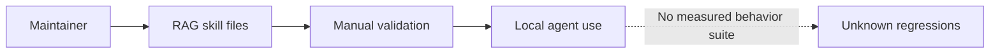
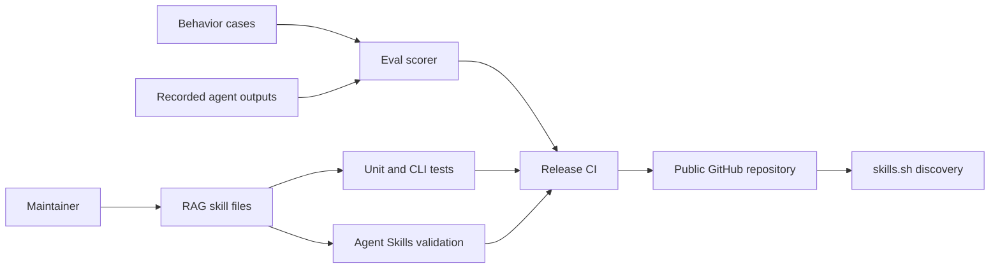

# RAG skill release-readiness plan

**Status:** IMPLEMENTED
**Mode:** IMPLEMENT
**Owners:** Repository maintainers
**Last updated:** August 13, 2026

## Outcome

Release `rag-production-engineer` as a portable Agent Skill with reproducible
behavior evaluations, deterministic script tests, specification validation,
and repository metadata suitable for distribution through `skills.sh`.

## Scope

This change covers skill behavior evaluations, script correctness tests,
portable output templates, continuous integration, and repository publishing
metadata. It does not add vendor SDKs, hosted evaluation infrastructure, or
credentials, and it does not publish to a remote GitHub repository.

## Evidence and assumptions

- MEASURED: The skill passes the local `quick_validate.py` check.
- MEASURED: The skill contains 385 lines, below the recommended 500-line cap.
- MEASURED: Four Python scripts currently have no automated test suite.
- MEASURED: The workspace has no root publishing metadata or CI configuration.
- DECIDED: Evaluation and tests use only the Python standard library.
- DECIDED: Agent outputs use a vendor-neutral JSONL interchange format.
- ASSUMED: Maintainers will choose the final GitHub owner before publishing.

## Current system

The repository contains one complete skill with references and helper scripts,
but verification is manual and there is no repeatable release path.

## Target system

The target keeps the skill vendor-neutral while adding deterministic checks and
a result format that any agent runner can produce.

## Gap analysis

The current skill needs behavioral test cases, a reusable scorer, malformed
input coverage, script regression tests, output assets, continuous validation,
and repository-level installation guidance. Vendor-specific integration packs
remain separate future skills so the core does not become a monolith.

## Delivery plan

1. Add a JSONL behavior corpus and a standard-library scorer that validates
   trigger decisions, routing, planning level, required signals, and prohibited
   claims.
2. Add fixtures and unit tests for retrieval metrics, trace analysis, both plan
   validators, and the behavior scorer.
3. Fix correctness and input-validation defects exposed by the tests.
4. Add reusable plan and evaluation assets, root metadata, and CI checks.
5. Run local specification, test, compile, and Skills CLI discovery checks.

Each slice is complete only when its public command exits with the expected
status for both passing and failing inputs.

## Evaluation and acceptance

- Unit tests pass locally on Python 3.12; CI runs the same suite on Python 3.11
  and 3.12 after the first push.
- Every Python file compiles.
- The skill passes `agentskills validate` when the official validator is
  available.
- `npx skills add . --list` discovers `rag-production-engineer`.
- The eval corpus includes positive, negative, security, migration, scale,
  incident, optimization, and bounded-change cases.
- A complete sample result set scores 100%; intentionally invalid results fail.

## Operability

CI emits machine-readable test failures and retains no prompts, credentials, or
agent transcripts. The eval scorer reports per-case failures so maintainers can
distinguish trigger regressions from behavioral regressions.

## Rollout and rollback

Land the harness and repository metadata without changing the skill's runtime
dependencies. If a new gate proves unstable across agents, keep the case and
mark its expectation for review instead of weakening unrelated checks. Rollback
consists of reverting the release tooling commit; installed skill behavior
remains unchanged unless a tested correctness fix is reverted with it.

## Risks and decisions

- Regex-based output scoring measures observable contracts, not semantic
  quality. Human or model-judge review remains necessary before major releases.
- The local environment may not have every target agent installed. CLI
  discovery can be verified locally; true agent trials require recorded output
  from each available runtime.
- `skills.sh` discovery requires a public GitHub repository, which cannot be
  completed until the maintainer selects and pushes to an owner/repository.
- CI uses the official Agent Skills reference validator plus local deterministic
  checks to avoid relying on one implementation.

## Plan audit

**Result: READY**

- PASS: The outcome maps to explicit delivery slices and acceptance checks.
- PASS: Current and target states are supported by repository inspection.
- PASS: The design adds no runtime vendor dependency or credential handling.
- PASS: Failure output, rollback, and residual cross-agent risk are explicit.
- PASS: No high-impact user decision blocks local implementation.

## Implementation evidence

- PASS: 17 unit and CLI tests pass on Python 3.12 and 3.14.
- PASS: Every Python script compiles on Python 3.12 and 3.14.
- PASS: `agentskills validate` from `skills-ref==0.1.1` accepts the skill.
- PASS: `skills@1.5.20` discovers exactly one skill from the repository.
- PASS: A temporary copy install succeeds for Codex, Claude Code, OpenCode,
  and Antigravity.
- PASS: The behavior corpus contains 12 valid cases: eight positive and four
  negative.
- PASS: Git is initialized locally on `main`.
- REMAINING: Python 3.11 and hosted CI execute after the first GitHub push.
- REMAINING: Cross-model behavioral scores need outputs from the target agents;
  installation compatibility alone does not prove behavioral parity.
