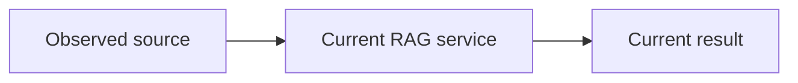
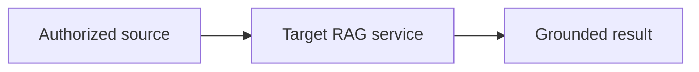

# RAG system change plan

**Status:** PROPOSED
**Mode:** DESIGN
**Owners:** UNKNOWN
**Last updated:** UNKNOWN

## Outcome

State the user or business outcome and the measurable completion condition.

## Scope

List included behavior and explicit non-goals.

## Evidence and assumptions

Label each input as `MEASURED`, `INFERRED`, `DECIDED`, `PROPOSED`, or `UNKNOWN`.

## Current system

Describe observed components, contracts, data, traffic, and constraints.

## Target system

Describe the minimum architecture that can pass the acceptance gates.

## Gap analysis

Connect each measured failure or requirement to one justified change.

## Compatibility matrix

For migrations, compare old and new data, embedding, authorization, score,
output, consistency, limit, and regional contracts. Record evidence and owner.

## Migration correctness

For migrations, define the source checkpoint, atomic change capture, capture
barrier, ordering, idempotency, tombstones, revocations, replay,
reconciliation, fallback freshness, and the condition that blocks cutover.

## Delivery plan

Define independently verifiable slices with dependencies and completion gates.

## Evaluation and acceptance

Specify datasets, slices, metrics, thresholds, and regression limits.

## Capacity, latency, and cost budgets

Show labeled workload conversions, capacity ranges, and cost formulas or
explicit unknown inputs. Use one table per user-visible critical path:

| Stage | Budget p95 (ms) | Evidence / formula |
| --- | --- | --- |
| Authorized retrieval | UNKNOWN | Measure at the stated load shape |
| Generation | UNKNOWN | Measure with the selected model and token range |
| Headroom | PROPOSED: 20% of measured stage subtotal | `headroom = 0.20 * stage_subtotal` |
| Total | UNKNOWN | `total = stage_subtotal + headroom` |

Keep unknown values symbolic. Do not invent numeric placeholders.

## Operability

Specify traces, metrics, dashboards, alerts, runbooks, and owners.

## Rollout and rollback

Specify exposure stages, stop conditions, rollback, and old-state cleanup.

## Risks and decisions

Record residual risks, then make unavailable owner input decision-ready:

| Decision | Recommendation | Alternatives | Impact |
| --- | --- | --- | --- |
| Name the decision | Recommend one option | List viable options | Explain how each option changes the plan |

## Plan audit

**Result:** FAIL

Replace `FAIL` with `READY` or `AWAITING_DECISIONS` only after the audit, and
record the evidence for that result.
