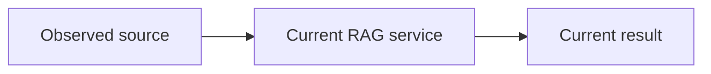
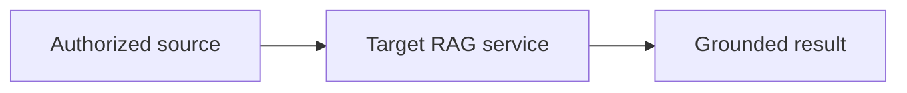

# RAG system change plan

**Status:** PROPOSED
**Mode:** DESIGN
**Owners:** UNKNOWN
**Last updated:** UNKNOWN

## Outcome

State the user or business outcome and the measurable completion condition.

## Scope

List included behavior and explicit non-goals.

## Evidence and assumptions

Label each input as `MEASURED`, `INFERRED`, `DECIDED`, `PROPOSED`, or `UNKNOWN`.

## Current system

Describe observed components, contracts, data, traffic, and constraints.

## Target system

Describe the minimum architecture that can pass the acceptance gates.

## Gap analysis

Connect each measured failure or requirement to one justified change.

## Delivery plan

Define independently verifiable slices with dependencies and completion gates.

## Evaluation and acceptance

Specify datasets, slices, metrics, thresholds, and regression limits.

## Operability

Specify traces, metrics, dashboards, alerts, runbooks, and owners.

## Rollout and rollback

Specify exposure stages, stop conditions, rollback, and old-state cleanup.

## Risks and decisions

Record decisions, unresolved high-impact questions, and residual risks.

## Plan audit

Record `PASS`, `FAIL`, `READY`, or `AWAITING_DECISIONS` with evidence.
