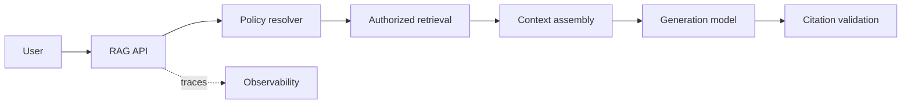
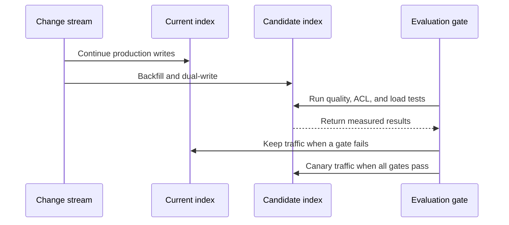

# Planning protocol

Use this reference for substantial RAG design, implementation, optimization,
and migration work. Produce a durable plan that explains the present system,
the intended system, the smallest justified delta, and how evidence controls
delivery.

Before reading further, confirm the first work update already states the mode,
planning level, and execution ledger. If it does not, stop and publish that
preflight before inspecting more files or delegating work.

## Choose the plan status

Place one explicit status near the top of the document.

- `PROPOSED` means the plan is ready for audit but not execution.
- `AWAITING_DECISIONS` means named user decisions block finalization.
- `READY` means the plan passed audit and has no blocking decisions.
- `APPROVED` means the user or an authorized reviewer accepted the plan.
- `IN_PROGRESS` means execution follows this plan.
- `IMPLEMENTED` means completion gates have fresh evidence.
- `SUPERSEDED` means a newer plan replaces this document.

Do not infer `APPROVED` from silence or from a successful structural audit.

## Resolve facts before asking

Inspect the codebase, configuration, deployment manifests, schemas, traces,
metrics, datasets, tests, and existing architecture records. Separate planning
inputs into:

- `MEASURED`: observed directly in current evidence;
- `INFERRED`: concluded from evidence and labeled with confidence;
- `DECIDED`: selected by the user or an existing authoritative record;
- `PROPOSED`: recommended by this plan;
- `UNKNOWN`: unavailable and potentially important.

Ask a clarification question only when an `UNKNOWN` can materially change
scope, architecture, security, data contracts, service-level objectives, cost,
or rollout. For every question, include the recommended answer, alternatives,
and impact. Group independent questions into one concise round.

## Build the document

Use the repository's planning location and format when one exists. Otherwise,
write `docs/plans/YYYY-MM-DD-<slug>.md`.

Start every plan with this structure:

```markdown
# <System or change> plan

**Status:** PROPOSED
**Mode:** DESIGN | IMPLEMENT | OPTIMIZE | MIGRATE
**Owners:** <known owner or UNKNOWN>
**Last updated:** YYYY-MM-DD

## Outcome

State the user or business result and measurable success criteria.

## Scope

List included behavior, explicit exclusions, constraints, and dependencies.

## Evidence and assumptions

Label each important input as MEASURED, INFERRED, DECIDED, PROPOSED, or
UNKNOWN. Link to source files, traces, dashboards, evaluation runs, or tickets.

## Current system

Describe deployed components, data flows, interfaces, scale, quality, latency,
cost, security, observability, failure behavior, and known limitations.

## Target system

Describe the intended contracts and behavior. Explain why this is the minimum
sufficient architecture.

## Gap analysis

Map each current limitation or requirement to the proposed change and its
evidence gate.

## Compatibility matrix

For `MIGRATE`, compare old and new contracts for embeddings, identifiers and
versions, filters and ACLs, score semantics and threshold consumers, retrieval
outputs, generation inputs and outputs, consistency, limits, and regional or
data-use constraints. Mark every row `COMPATIBLE`, `ADAPTER_REQUIRED`,
`REINDEX_REQUIRED`, `BLOCKED`, or `UNKNOWN`, with evidence and an owner.

## Migration correctness

For `MIGRATE`, define the source-of-truth snapshot or checkpoint, change-stream
watermark, per-record version ordering, idempotency keys, tombstones, permission
revocations, replay, reconciliation, and the freshness gate for every fallback.
Show separate authorization adapters for each vendor when their filter semantics
differ. A retained but stale index is not a valid failover.

## Delivery plan

Break work into independently testable slices. Define inputs, outputs,
dependencies, verification, rollback, and completion criteria for every slice.

## Evaluation and acceptance

Define datasets, query slices, metrics, thresholds, load shape, security tests,
failure exercises, and comparison method.

## Capacity, latency, and cost budgets

Show workload conversions, capacity assumptions, critical-path latency by
stage with headroom, cost formulas, sensitivity ranges, and evidence labels.
Represent parallel stages as one critical-path row using the slower branch;
never add concurrent branch budgets as if they run sequentially. Recompute every
declared table total. If traffic duty cycle, peak ratio, or vendor throughput is
not user-provided or measured, keep it `UNKNOWN` and show sensitivity cases.
Link every exact vendor price to a first-party source with date, region, plan,
and SKU; do not average a regional price range into a fictional midpoint.

## Operability

Define traces, metrics, logs, dashboards, alerts, ownership, runbooks,
retention, and cost attribution.

## Rollout and rollback

Define flags, shadowing, dual-running, canaries, cutover, rollback triggers,
recovery, reconciliation, and old-state retirement.

## Risks and decisions

Record risks, mitigations, rejected alternatives, decisions, open questions,
and evidence-based upgrade triggers.

## Plan audit

Record the audit result, gaps found, revisions made, and final readiness state.
```

Put the lifecycle result only on an explicit `**Result:**` line in the plan
audit. Explanatory prose may discuss future states without changing the
recorded result.

Add file paths, interfaces, schemas, commands, and expected results when they
remove implementation ambiguity. Avoid fictional line numbers or code details
that repository inspection cannot support.

## Diagram the change

Use Mermaid when the renderer supports it. Use ASCII only when Mermaid is not
supported. Every diagram must explain a decision, boundary, or sequence.

For `P2`, include at least:

1. A current-state data-flow or component diagram.
2. A target-state data-flow or component diagram.

For `P3`, also include:

3. A migration, cutover, fallback, or failure sequence diagram.

For `MIGRATE`, the sequence must show the snapshot/checkpoint, dual-write or
change capture, ordered backfill, delete and revocation handling,
reconciliation, shadowing, canary, cutover, fallback, and retirement. Keep
retrieval-provider and generation-model flags independent. Validate the crossed
combinations offline, then canary one production axis at a time so regressions
remain attributable.

The sequence must represent the observed current state and proposed rollout.
For greenfield work, use an initial rollout or failure sequence; do not invent a
current production index, dual-write path, or rollback state only to satisfy the
diagram requirement.

Use stable component names that match the prose and implementation. Mark trust
boundaries, tenant or ACL enforcement, asynchronous queues, external vendors,
and observability paths when relevant. Label unknown or inferred components.

Keep diagrams scoped. Split one unreadable diagram into ingestion, query, and
control-plane views. Do not decorate a plan with diagrams that repeat the prose.

Example architecture diagram:



Example migration sequence:



## Design delivery slices

Make each slice independently reviewable and verifiable. Prefer vertical slices
that include behavior, tests, telemetry, and rollback over horizontal phases
that build all infrastructure before proving user value.

For every slice, specify:

- objective and user-visible or operational outcome;
- files, services, indexes, or contracts affected;
- dependencies and compatibility requirements;
- implementation decisions and explicit non-goals;
- tests, evaluation cases, and expected evidence;
- rollout, fallback, rollback, and cleanup;
- completion criterion and owner.

For large programs, group slices into milestones. End each milestone with a
usable, observable, and reversible system state.

## Audit the proposed plan

Audit the complete draft before asking the user questions or starting work.
Trace every finding to a revision, open decision, or accepted risk.

Verify these dimensions:

- **Outcome coverage:** Every requested result has an implementation slice and
  acceptance gate.
- **Current-state fidelity:** Claims about the existing system have evidence or
  an explicit inference label.
- **Decision completeness:** Interfaces, ownership, data contracts, versions,
  and failure behavior do not require implementer guesswork.
- **Minimum architecture:** Every added component targets a named failure or
  requirement.
- **Data lifecycle:** Ingestion, updates, deletes, backfills, reconciliation,
  versioning, and rollback are covered.
- **Security:** Authorization applies to primary, cache, fallback, and vendor
  paths; sensitive telemetry and data handling are defined.
- **Migration correctness:** Backfill and live mutations converge from a named
  checkpoint; version ordering prevents stale overwrite; deletes and permission
  revocations meet a defined propagation objective; every fallback passes a
  freshness watermark before serving.
- **Compatibility:** Embedding dimensions and metric, stable identifiers,
  filter semantics, score distributions and threshold consumers, and output
  schemas have explicit evidence or a blocking decision.
- **Change attribution:** Retrieval and generation changes have separate flags,
  crossed offline evaluation, and sequential production canaries.
- **Scale and economics:** Workload, capacity, tail latency, cost, quotas, and
  tenant skew have measurable treatment.
- **Numerical integrity:** Units, duty cycle, formulas, arithmetic, headroom,
  ranges, and evidence labels are explicit and independently recomputed.
- **Quality:** Retrieval and generation have separate datasets, slices,
  metrics, and thresholds.
- **Reliability:** Timeouts, retries, circuits, degradation, recovery, and
  destructive actions are bounded.
- **Operability:** Traces, dashboards, alerts, owners, and runbooks support the
  proposed system.
- **Delivery safety:** Dependencies, canaries, rollback triggers, and old-state
  retirement form a complete sequence.
- **Verification:** Every completion claim maps to a command, evaluation,
  benchmark, inspection, or failure exercise.
- **Document integrity:** Terms, component names, interfaces, diagrams, and
  delivery slices agree; status matches the audit result; no placeholders
  remain.

## Finalize the plan

After the audit, resolve discoverable findings and ask only blocking
clarifications. Update the document with answers and decisions. Mark the plan
`READY` when no material ambiguity remains and every planned slice has a
completion criterion.

Run the structural validator before changing the status to `READY`:

```bash
python3 scripts/validate_plan_document.py docs/plans/<plan>.md --level P2
python3 scripts/validate_plan_document.py docs/plans/<plan>.md --level P3
```

The validator checks metadata, required sections, current and target diagrams,
the additional `P3` sequence diagram, audit presence, and unresolved placeholder
language. It does not prove that decisions are correct; complete the semantic
audit above as well.

If implementation evidence invalidates the plan, pause the affected slice,
update the evidence and decision record, re-audit impacted sections, and then
resume. Preserve the old decision and reason for the revision instead of
silently rewriting history.
