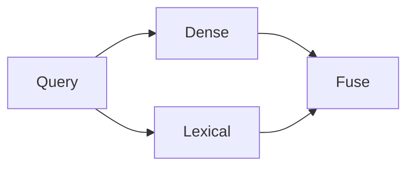

# Search quality plan

**Status:** APPROVED
**Mode:** IMPLEMENT
**Owners:** Search platform
**Last updated:** August 13, 2026

## Outcome

Improve exact-match recall without reducing authorization safety.

## Scope

Add lexical retrieval behind the existing retrieval interface.

## Evidence and assumptions

MEASURED: Dense retrieval misses exact product codes.

## Current system

## Target system

## Gap analysis

The current route has no exact-token retrieval.

## Delivery plan

Add and test one lexical adapter and fusion stage.

## Evaluation and acceptance

Exact-code recall must improve without ACL regressions.

## Operability

Trace each retrieval route and fusion result.

## Rollout and rollback

Use a feature flag and retain dense-only retrieval.

## Risks and decisions

DECIDED: Reuse the existing authorization filter.

## Plan audit

Result: PASS and READY for implementation.
