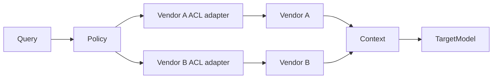
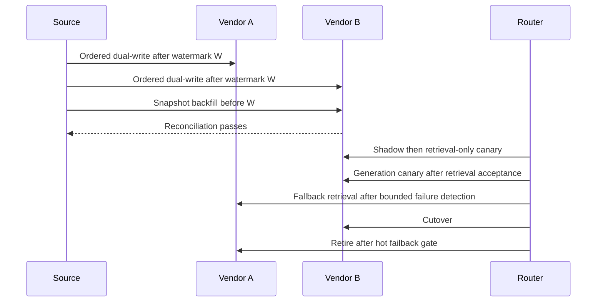

# Retrieval vendor migration plan

**Status:** AWAITING_DECISIONS
**Mode:** MIGRATE
**Owners:** Search platform
**Last updated:** August 13, 2026

## Outcome

Move retrieval from Vendor A to Vendor B without downtime or authorization
leakage, while retaining a bounded hot failback window.

## Scope

Migrate the existing index and generation model. Preserve chunking and source
connectors.

## Evidence and assumptions

MEASURED: Vendor A serves 80 million chunks. UNKNOWN: effective Vendor B
throughput and approved dual-run cost ceiling.

## Current system

## Target system

## Gap analysis

Vendor B needs a compatible index, distinct authorization translation, and
measured score calibration before it can serve traffic.

## Compatibility matrix

| Contract | Vendor A | Vendor B | State and gate |
| --- | --- | --- | --- |
| Embedding model, dimensions, and distance metric | Current values | UNKNOWN | BLOCKED until verified |
| Stable document and chunk identifiers with source version | Supported | UNKNOWN | ADAPTER_REQUIRED |
| ACL and metadata filter semantics | Native policy | Different filter model | ADAPTER_REQUIRED |
| Score semantics and threshold consumers | Current baseline | Different distribution | Calibrate thresholds |
| Generation output schema | Current generator | Target generation model | Crossed evaluation required |

## Migration correctness

The source of truth produces a reproducible snapshot at checkpoint `S` and a
change-stream watermark `W`. Change capture starts at `W`; workers backfill the
snapshot, then replay later mutations in source-version order. Conditional
writes and idempotency keys prevent stale backfill records from overwriting live
updates. Versioned tombstones carry deletes and permission revocations until
both indexes acknowledge them. Reconciliation compares tenant counts, record
hashes, versions, missing and extra IDs, tombstones, and authorization decisions.

The canonical policy resolver compiles each decision through a separate Vendor
A ACL adapter and Vendor B ACL adapter. Both paths fail closed and apply a
post-retrieval authorization check. Vendor A remains a fallback only while its
data and policy freshness watermark is current; after dual-write stops it is
retention-only, not a failback.

## Delivery plan

Add adapters and change capture, backfill from the checkpoint, reconcile,
shadow Vendor B, canary it, cut over, hold the hot failback window, then retire
Vendor A.

## Evaluation and acceptance

Run crossed evaluation across all four retrieval and generation combinations.
Use independent retrieval and generation flags with separate production
canaries. Require zero unauthorized results, bounded over-filtering, calibrated
thresholds, and accepted retrieval and answer-quality deltas.

## Capacity, latency, and cost budgets

UNKNOWN: effective chunks per second and production QPS. Migration duration =
remaining chunks / effective chunks per second. One-time backfill cost = source
reads + writes + egress + optional embedding. Incremental dual-run cost per day
= Vendor A storage and queries + Vendor B storage and shadow queries. All prices
remain UNKNOWN until verified.

Fallback critical path:

| Stage | Budget p95 | Notes |
| --- | --- | --- |
| Policy resolution | 20 ms | PROPOSED |
| Primary failure-detection deadline | 100 ms | PROPOSED bounded deadline |
| Vendor A ACL adapter | 10 ms | PROPOSED |
| Fallback retrieval | 200 ms | PROPOSED Vendor A measurement gate |
| Context assembly | 30 ms | ESTIMATED |
| Generation | 500 ms | ESTIMATED |
| Validation | 20 ms | ESTIMATED |
| Headroom | 120 ms | PROPOSED |
| Total | 1,000 ms | Recomputed critical path |

## Operability

Trace source version, data and policy watermarks, vendor route, fallback reason,
retrieval scores, generation model, and reconciliation lag. Alert on stale
authorization, divergence, leakage, and deadline exhaustion.

## Rollout and rollback

Rollback requires Vendor A to pass data and policy freshness gates. The primary
failure-detection deadline plus fallback retrieval must remain inside the
fallback latency budget. Keep retrieval and generation flags independent.

## Risks and decisions

AWAITING_DECISIONS for embedding compatibility, ACL differences, throughput,
cutover thresholds, and the dual-run ceiling.

## Plan audit

Result: AWAITING_DECISIONS. Contract validation passes, but owner decisions and
measured baselines still block implementation.
